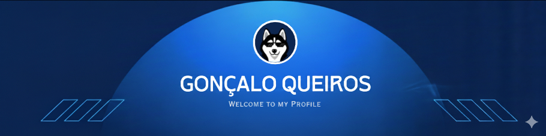

<!-- ANIMATED BANNER -->

  

# ɪ'ᴍ ɢᴏɴᴄ̧ᴀʟᴏ ǫᴜᴇɪʀᴏ́ꜱ!
  

&nbsp;&nbsp;&nbsp;&nbsp;I am a Full Stack Developer passionate about building web applications using Laravel, Node.js, React.js, and JavaScript. I enjoy creating projects and sharing my work on GitHub.

  

- ⭐ Always striving to **improve code quality** and learn new technologies.  
- 🌐 Focused on **modern front-end development**, with a strong interest in back-end.  
- 💻 Goal: to build **solutions that truly make a difference**. 

 

---

###  GitHub Stats

  <a href="https://github.com/Goncalo842">
    
    
  </a>
   

---

###  Technologies & Tools

#### 🖥️ Back-End  

#### 🎨 Front-End  

### 💻 Languages

#### 🗄️ Databases  

### 🛠️ Tools

---

###  Where to Find Me

  
  

---

  <picture>
    <source media="(prefers-color-scheme: dark)" srcset="https://raw.githubusercontent.com/Goncalo842/Goncalo842/output/github-contribution-grid-snake-dark.svg">
    <source media="(prefers-color-scheme: light)" srcset="https://raw.githubusercontent.com/Goncalo842/Goncalo842/output/github-contribution-grid-snake.svg">
    
  </picture>

---
